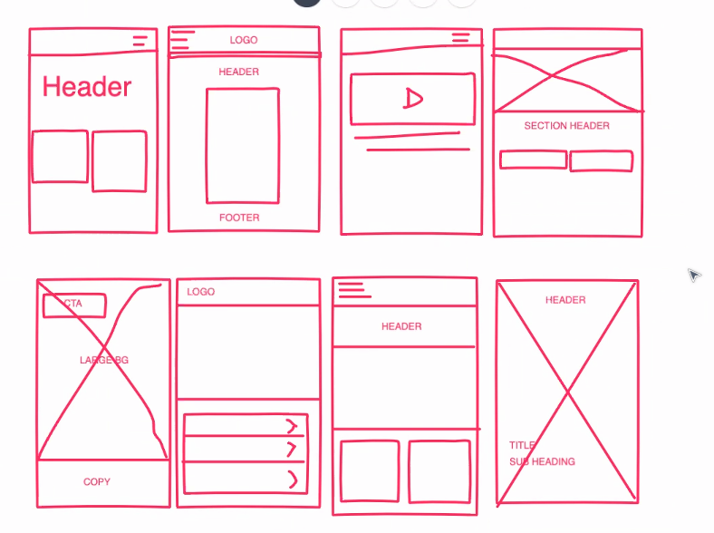

# Ideation

Ideation can come in many forms. Ideation can happen anywhere (even remotely) at any time. It can happen in 15 minutes, or throughout several months. Ideation can tackle small design challenges and brand new products.

At the end of this module, you should be able to:
- articulate why lo-fi ideation is a key component of the UX design process.
- to sketch ideas digitally.
- execute a 'Crazy 8s' ideation exercise.

  

 Table of Contents:

a. [Additional Resources](#Additional-Resources)     
b. [Assignment](#Assignment)     
c.      
d.      
e.      
f.      
g.      
h.      
j.      
k.      
l.      
m.      

 
 

## Additional Resources

#### Pre-Class Links

[What is Ideation?](https://www.interaction-design.org/literature/topics/ideation) - by Interaction Design Foundation  

[8 UX Ideation Techniques to Try Out](https://www.justinmind.com/blog/8-ux-ideation-techniques-to-try-out/)  

[Crazy 8's Exercise](https://designsprintkit.withgoogle.com/methodology/phase3-sketch/crazy-eights) by Design Sprints.  

 

[Ideation for UX9 with Alec Davis](https://youtu.be/BdvFkhMWCOs)  

[Ideation for UXPT3 with Corey Nelson]()  

## Assignment

#### Instructions

1. Get a sheet of paper, a timer, and a sharpie.
2. Fold the sheet of paper into eight sections.
3. Set the timer for 8 minutes.
4. Using the ‘Crazy 8’s’ method’, sketch eight unique home pages for Newsie in 8 minutes. You do not need to sketch the entire page, only whatever will be seen above the fold. 
Remember, erasing is not allowed. Sketches should be rough!

5. Review the sketches and choose the one that you believe best solves the challenge.

6. Using the chosen sketch, create additional sketches (3-5) that demonstrate an action the user might take from that page. For example, if you chose the home page, you may choose to sketch out the remainder of a sign-in flow.

7. When you are finished, write a 500-700 word reflection statement detailing your experience with the Crazy 8s method and UX sketching. Discuss how the method will aid in your design process going forward.

 

#### Stretch Goals

Create a digital prototype of your sketches using InVision.

 

#### Submission

 - [ ] Submit an image of your initial 8 sketches
 - [ ] Submit an image of the additional (3-5) sketches that demonstrate an action the user might take from the homepage.
 - [ ] Submit your blog post (live or doc) to your PM.

 
 

## Ideation Sessions

All ideation sessions have three main characteristics.

### Ideas are not evaluated. 

We want to make sure that ideation sessions are void of critiques. It is essential that everyone feels comfortable ideating without being evaluated. Fostering the proper environment is of the utmost importance when conducting ideation sessions. Even potentially bad options can lay the groundwork for fantastic solutions.

 

### Ideas are recorded, and the session is documented. 

We can record ideas in many ways. Paper, pencil, voice recorder, video recorder, camera, and markers are just a few of the many ways that we can document ideas. It is essential that ideas are documented to ensure the participants/stakeholders can evaluate the ideas at a later date. It is essential to avoid deleting artifacts, as they all hold valuable information that can be used and built upon later.

 

### Collaboration spurs diverse ideas. 

Ideation can happen both alone and in a group. However, ideating with another individual, or a group can help spur creativity. Ideating with a group of diverse individuals helps to bring a diverse set of backgrounds, and therefore viewpoints, to the table. Ideating in this manner will likely save time and frustration in the long-run.

 
 

## Ideation Challenges

The most common complaint against conducting ideation sessions is a lack of time during an already constrained product design cycle (NNGroup). Although ideation does take time, it is important to remember that even a single session of 3 hours or less can uncover valuable information that can significantly impact the success of a product. Frequently, how participants spend their time during an ideation session is the most significant indicator of how successful the session will be. Remaining focused on the task at hand and properly documenting the ideation session helps to get the most value out of the session.

A lack of upper managerial support can also have a significant impact on the ability to conduct ideation sessions. If upper management does not support taking time to conduct this type of work, it can be challenging to get others to participate. Showing value early in the process and explaining how group ideation could have solved issues in the past are a couples way of potentially dealing with a lack of managerial support.

Ideation at any point in the product design process is beneficial. However, there are times when ideation is more beneficial than others. Ideation tends to be most effective directly after user research. Ideating after user research helps to keep the team focused on the outcomes of the research, and build toward a practical prototype.

 
 

## Ideation Sketching

Humans innately have a desire to create beautiful things. Ideating in UX, whichever form that takes, is not meant to be beautiful. We are using sketches to convey ideas. We want to provide people with a visual representation of an idea. Putting too much detail in sketches can be a detriment. We want to be sure that our audience is focusing on the themes being conveyed by the sketches, not on the details.

We use sketching to help us generate ideas. Sketching can happen on paper, on a whiteboard, and of course, digitally. Each medium presents its strengths and weaknesses. Sketching also aids exploration. Unlike writing, sketching can happen at the speed of thought. Visual ideas can be portrayed quickly without much effort.

One of the biggest blockers to ideating (and henceforth sketching) is self-censoring. Remember, self-censoring blocks innovation. All ideas inherently have value. Even if the idea does not immediately work, or make complete sense, it might spark other ideas. Avoid being ashamed of ideas and value will shine through.

As we iterate on visual ideas and prepare to present them to potential stakeholders, lo-fidelity ideation using sketches or a similar medium will help stakeholders understand the vision of the product.

 
 

## Crazy 8s Method

The Crazy 8s exercise is meant to be conducted early on in the product design life cycle. The Crazy 8s exercise helps participants explore several conceptual designs rapidly. A typical Crazy 8s exercise session will go as follows:

Choose a design medium (paper, digital, whiteboard), and a timer
If using paper, fold the paper into eight distinct squares
Set the timer for 5 minutes (40 seconds per square)
Sketch a unique design idea in each square. Sketches are expected to be rough
Once ideas are exposed, designers and participants will converge ideas and create a single prototype to test with users. At this stage, it is essential to ensure that creating the prototype takes minimal time and effort. The purpose of this prototype will be to test with users and immediately iterate. Designers should repeat this cycle until they feel confident in the direction of the design.

 
 

## Rapid Iteration

After ideating, it is a good idea to validate the design ideas with users. Prototyping is one of the fastest and easiest ways to do this. With paper sketches, a prototype can be quickly created by snapping photos of the sketches and linking the sketches together in a prototyping tool, such as POP (Prototyping on Paper by Marvelapp). A simple prototype can be tested with users to understand the effectiveness of the design better. Once we evaluate the prototype, iteration can begin, and the cycle begins again.

A conventional rapid iteration cycle is as follows:

- Create an initial interface design. Sketching or lo-fi wireframes are preferable.  
- Present the design to real or potential users of the final product.  
- Note problems users encounter during the testing period.  
- Refine the interface to account for the problems.  
- Repeat this process and resolve all problems.  

 
 